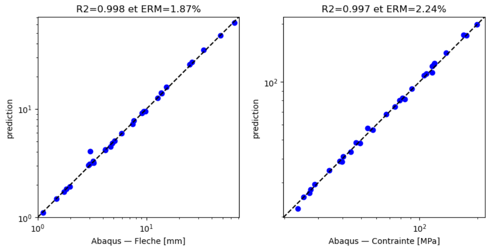
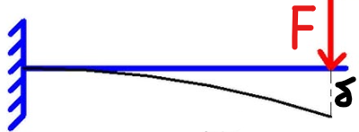
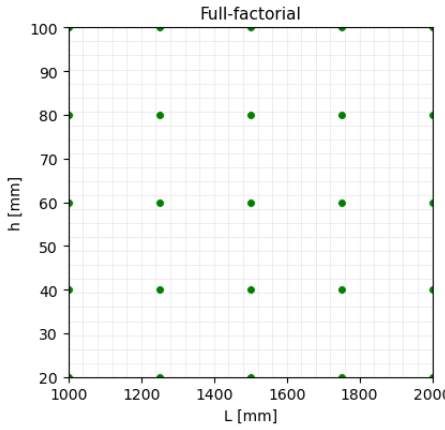
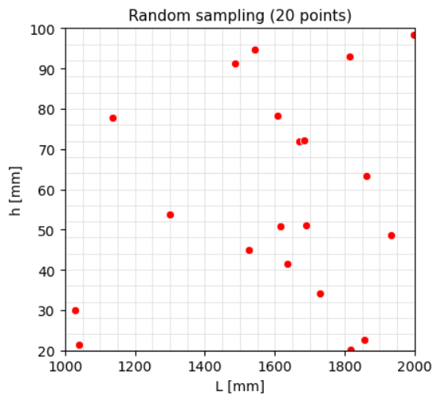
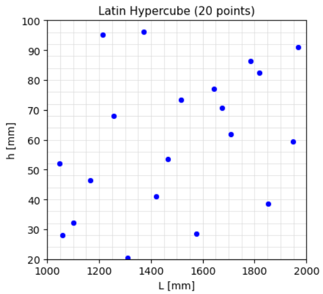
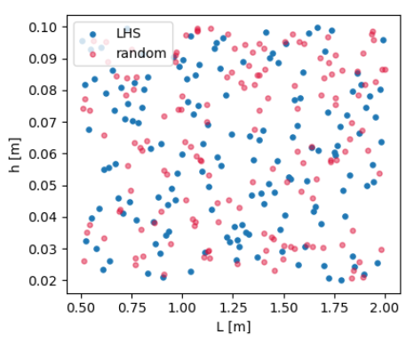
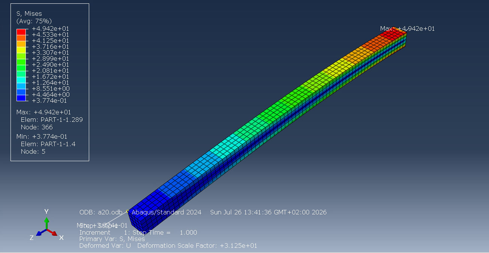
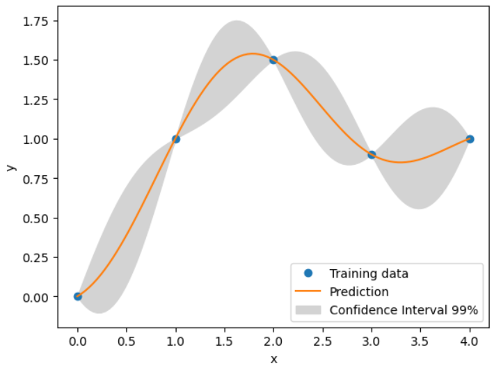

# création d'un surrogate

Le surrogate est une technique utilisée pour approximer des simulations avec des outils qui nécessitent moins de puissance et de temps de calcul. Dans notre cas il nous permettra d'optimiser la surface d'une poutre sous contrainte ce qui aurait pris plusieurs heures sur abaqus

Ce dépôt est organisé en deux parties :
- La Partie 1 qui est une appropriation du modèle sur un cas maîtrisé simple : la flexion d'une
  poutre encastrée-libre, dans le cadre des petites perturbations.
- La Partie 2 qui est la comparaison de notre méthode de résolution avec un surrogate de référence, le SMT ([lien](https://smt.readthedocs.io/en/latest/)).

## Résultats clés sur les méthodes de résolutions

surrogate avec 3 entrées (b,h,L) variables 2 fixes F et E pour 2 sorties ( fixer E et F multiplie juste la relation de la fleche par une constante.): la fleche, la contrainte max avec 30 simulations abaqus pour entrainer le modéle et 20 de test. Ce modéle sert pour optimiser la section et trouver la poutre la plus légère en respectant sans relancer Abaqus.

| configuration log| $R^2$ flèche | ERM flèche | $R^2$ sigma max | ERM sigma max |
|:---:|:---:|:---:|:---:|:---:|
| SMT tuné | 0.9986 | $\color{green}{1.37} $ % | 0.9974 | 2.32 % |
| kriging maison tuné | 0.998 | 1.86 % | 0.997 | $\color{green}{2.23}$ % |

- appliquer la fonction log aux sorties rends unanimement les modéles de kriging plus efficaces
- mon kriging maison atteint un $R^2$ satisfaisant et compétitif par rapport au SMT et en terme d écart réel médiane (ERM) est similaire à 0.5% prés ce qui valide mon travail 

<p align="center">
  
  <br>
  <em>Figure 1 résultat de mon code par rapport à la premiere bisectrice des axes ( ce que mon code est censé faire) </em>
</p>


# Partie 1 appropriation du concept

Plus précisément, au lieu d'exécuter des simulations complètes coûteuses pour chaque variation de l'ensemble de paramètres de notre problème, un modèle de substitution est entraîné à l'aide d'un nombre limité de simulations ABAQUS. Ce modèle peut ensuite prédire rapidement les déformations, contraintes, flèches etc... pour de nouvelles valeurs d'entrée.

## le pb physique

Pour s'approprier le problème, on étudiera une poutre (de base b et hauteur h) encastrée en x = 0, libre en x = L, soumise à une force dans le plan notée F, appliquée à son extrémité libre (même exemple que le tuto 3DEXPERIENCE "AI/ML in Physics simulations: Introduction to Surrogate Modelling with a beginner level workflow".)

<p align="center">
  
  <br>
  <em>Figure 2 Poutre encastrée libre de longueur L, section bh, soumise à une force F à l'extrémité.</em>
</p>

### Hypothèses
Pour notre modèle, on respectera les hypothèses suivantes :
- *Petites perturbations (HPP)*
- *Poutre élancée* (L/h ≥ 10)
- *hypothèse de Bernoulli*
- *Matériau élastique linéaire* module d'Young E constant.

L'équation de la déformée par Euler-Bernoulli donne :

$$
EI\,\frac{d^{2}y}{dx^{2}} = M(x)
$$

le moment fléchissant vaut :

$$
M(x) = Fx - FL
$$

En intégrant deux fois avec $C_{1,2} \in \mathbb{R}$ :

$$
EI\,y(x) = \frac{F x^{3}}{6} - \frac{F L x^{2}}{2} + C_{1}x + C_{2}
$$

Les *conditions aux limites* à l'encastrement (déplacement et rotation nuls) :

$$
\begin{cases} y(0) = 0 \\ \dfrac{dy}{dx}(0) = 0 \end{cases}
\quad\Longrightarrow\quad C_{1} = C_{2} = 0
$$

La flèche maximale, atteinte à l'extrémité libre $x = L$, vaut donc :

$$
\delta = y(L) = \frac{F L^{3}}{3 E I}
$$

Sous les mêmes hypothèses, la contrainte de flexion est maximale dans la hauteur max de la poutre ($y = h/2$) et à l'encastrement ($x = 0$), où le moment est maximal en valeur absolue.

$$ \sigma_{max} = max(|\frac{M(x)\,(h/2)}{I}|) = \frac{F L\,(h/2)}{I}  \quad avec \quad I = \dfrac{b h^{3}}{12}$$

---

## le modèle

### La génération des points pour entraîner le modèle

En premier lieu, il est nécessaire de fournir des données pour entraîner le modèle. En pratique, ce sont les résultats de simulations Abaqus de différentes configurations (les dimensions, dans notre cas) du système que l'on veut lui faire apprendre, mais aussi vérifier la fiabilité du modèle.

Pour résoudre notre problème, on a besoin de ces cinq paramètres qui définiront la poutre : (L, b, h, F, E). Le surrogate apprend la relation entre ceux-ci et (δ, σ_max), qui sont quant à elles inconnues. Les bornes des valeurs d'entrée sont choisies de telle sorte que les poutres générées respectent les hypothèses de notre modèle, définies précédemment.

Or, on ne va pas simuler toutes les poutres du domaine de validité : on choisira une méthode d'échantillonnage parmi ces trois.

- **Le full-factorial sampling** utilisé pour des résolutions d'équations en discrétisant. Il consiste à balayer toute une zone de manière régulière. Il n'est pas adapté à notre cas, car chaque point coûte cher et cela reviendrait à traiter le problème entièrement sous Abaqus.

<p align="center">
  
  <br>
  <em>Figure 3 Illustration de la méthode full-factorial sampling</em>
</p>

- **Le random sampling**, utile pour des problèmes où le jeu de données initial est grand et coûte peu (les PINN, par exemple). Dans notre cas, il n'y a pas assez de points, donc il ne recouvre pas tout le domaine, comme illustré ci-dessous.

<p align="center">
  
  <br>
  <em>Figure 4Illustration de la méthode random sampling</em>
</p>

- **Le Latin Hypercube Sampling (LHS)**, que l'on retiendra, car il conserve une part d'aléatoire tout en tirant un jeu de points inhérent aux poutres, sans pour autant couvrir tout l'espace. Il y arrive en quadrillant l'espace et en y attribuant minimum 1 point.

<p align="center">
  
  <br>
  <em>Figure 5 Illustration de la méthode Latin Hypercube Sampling</em>
</p>

La différence entre le random sampling et le LHS est encore plus flagrante sur mes propres données, avec b (base de la poutre) et L (longueur de celle-ci) :

<p align="center">
  
  <br>
  <em>Figure 6 Comparaison random sampling / LHS sur le plan (L, b)</em>
</p>

Plus précisément, le tirage est codé de la manière suivante :

```python
X1 = qmc.LatinHypercube(d, seed).random(n)
X2 = qmc.scale(X1, borne_inf, borne_sup)
```
avec **X1** : un tableau de taille (n, d) de points tirés dans [0, 1] par la méthode LHS ;
et **X2**  : un tableau de même taille, mis à l'échelle entre les bornes inférieure et supérieure renseignées.

Ces points serviront ensuite à alimenter un fichier CSV utilisé en entrée d'Abaqus.

Simulations Abaqus qui ont un maillage approximant les 600 éléments au minimum, une force posée avec un point de couplage distributing, et des éléments hexaédrique C3D20R.
On remarquera que le max est bien proche du début de la poutre, ce qui vérifie la théorie des poutres.

<p align="center">
  
  <br>
  <em>Figure 7 illustration d'une simulation Abaqus d'une poutre dans le domaine de notre problème</em>
</p>

---

### Le choix des métriques

Pour savoir si les modèles sont satisfaisants, je choisis un $R^2$ plutôt qu'une MSE, afin de pouvoir comparer les erreurs des différentes sorties entre elles (la MSE dépend des unités des sorties et rend la comparaison entre les sorties difficile pour savoir laquelle est mieux approximée). Trouvé avec l'article [lien](https://www.sciencedirect.com/science/article/abs/pii/S1270963815000784).

$$R^{2} = 1 - \frac{\sum_{i}\left(y_i - \hat{y}_i\right)^{2}}{\sum_{i}\left(y_i - \bar{y}\right)^{2}}$$

où $y_i$ est la sortie de référence, $\hat{y}_i$ la sortie du surrogate et $\bar{y}$ la
moyenne des valeurs de référence.

De plus, j'utilise l'erreur relative médiane (ERM), car le projet PINN a montré que deux modèles peuvent avoir la même moyenne tout en se comportant différemment, l'un présentant une plus grande variance dans ses sorties. De plus, elle est adimensionnée et permet de prendre en compte l'influence des grandes comme des petites valeurs en divisant par leurs valeurs. En pratique, elle mesure si le R² est bon parce que les données sont toutes bonnes ou si ce sont de grands écarts qui se compensent (pas voulu si on veut prédire une courbe en pratique).

$$E_{\text{rel}} = \underset{i}{\mathrm{med}} \left( \frac{\left| \hat{y}_i - y_i \right|}{\left| y_i \right|} \right) \times 100$$


---

### La méthode d'apprentissage

Pour le surrogate, il existe principalement trois méthodes d'apprentissage : la régression polynomiale, le krigeage et les MLP.

J'écarte d'emblée les MLP car, comme vu dans le projet PINN, ils sont efficaces avec un grand jeu de données, ce que le surrogate cherche justement à éviter car l'obtention de données est coûteuse. De plus, on perd de l'information du fait de leur nature de ' boîte noire ', a contrario du kriging qui apporte une variance sur tout le domaine de sortie.

#### Le surrogate par régression polynomiale

Il est réalisé avec la bibliothèque sklearn, plus simple à mettre en place. Compte tenu du fait que l'on produit un polynôme à plusieurs variables, il obtient de piètres résultats, même en normalisant les entrées. Une technique découverte consiste à appliquer la fonction log (toutes nos données sont positives tant qu'elles ne sont pas normalisées), de telle façon que les exposants soient appris plus facilement :

$$\text{par exemple} \quad \delta = \frac{4\, P\, L^3}{E\, b\, h^3} \quad \text{donne en log :} \quad
\log\delta = \log 4 + \log P + 3\log L - \log E - \log b - 3\log h$$

On repasse ensuite par l'exponentielle pour retrouver la bonne expression.

Ainsi, c'est avec les données normalisées que j'ai testé, avec plusieurs degrés de polynômes, les valeurs de prédiction des flèches et des contraintes maximales.
Pour les couleurs et l'interprétation des données, j'ai décidé de me baser sur ce document ([justification R²](https://pmc.ncbi.nlm.nih.gov/articles/PMC12622781/) table 6) qui donne la valeur classique de résultat de surrogate (approximativement $R^2$ = 0.98) ; les valeurs en dessous de celle-ci et au-dessus de 0.8 sont médiocres (en gris) et celles en dessous de 0.8 extrêmement mauvaises (en rouge).
Pour ce qui est de l'ERM, je n'ai trouvé nulle part d'utilisation de cette métrique dans le domaine (peut-être n'est-elle pas adaptée). Ainsi, je considère que le modèle est satisfaisant au niveau de l'ERM si elle est en dessous de 5 % et extrêmement mauvaise si elle est au-dessus de 20 %. Dans la réalité, ces valeurs-là sont fixées par le cahier des charges et ce que l'on veut vraiment.

| degré | 1 | *2* | 3 | 4 | 5 | 6 | 1 en entrée log |
|:---:|:---:|:---:|:---:|:---:|:---:|:---:|:---:|
| $R^2$ flèche | $\color{red}{0.73}$ | 0.93 | $\color{red}{0.55}$ | 0.87 | $\color{red}{0.78}$ | $\color{red}{0.13}$ | $\color{green}{0.99}$ |
| ERM flèche | $\color{red}{41.6}$ % | $\color{red}{24.0}$ % | $\color{red}{27.3}$ % | $\color{red}{29.7}$ % | $\color{red}{36.4}$ % | $\color{red}{94.4}$ % | $\color{green}{0.17}$ % |
| $R^2$ sigma max | 0.84 | 0.95 | 0.89 | 0.82 | $\color{red}{0.63}$ | $\color{red}{0.09}$ | $\color{green}{0.99}$ |
| ERM sigma max | $\color{red}{21.0}$ % | 11.2 % | 5.1 % | 18.2 % | $\color{red}{21.9}$ % | $\color{red}{36.2}$ % | $\color{green}{0.62}$ % |

On remarque que l'ERM est utile, par exemple pour la flèche de l'ordre 2 qui est passable avec un R² de 0.93 mais une ERM désastreuse, ce qui signifie qu'en pratique ce modèle n'est pas fiable dans tout le domaine.
Par ailleurs, on observe un surapprentissage à l'ordre 6 avec les métriques qui ne sont pas satisfaisantes.
Finalement, la sortie en log produit des résultats qui seraient réellement utilisables pour un surrogate (la raison est dans l'explication plus haut), donc à tester si on connaît la relation de départ et qu'elle est multiplicative.

#### Le krigeage
Il se présente comme une régression, mais qui quantifie la variance autour de chaque point. Elle se resserre près des points connus et s'élargit dans les zones peu explorées. De plus, cette variance peut servir à choisir le prochain point à simuler.

<p align="center">
  
  <br>
  <em>Figure 8Illustration de la méthode du krigeage</em>
</p>

La zone grise est calculée avec le kernel que l'on définira ensuite, et chaque prédiction possède son incertitude, ce qui est pratique pour savoir sur quels points le modèle est fiable.

Le krigeage modélise la réponse comme la somme de deux termes (conventions de SMT) :

$$\hat{y}(\mathbf{x}) = \underbrace{\sum_{i=1}^{k} \beta_i f_i(\mathbf{x})}_{\text{paramètres que l'on entraîne}} + \underbrace{Z(\mathbf{x})}_{\text{influence des points connus réglée par le noyau}}$$

- le premier terme est constitué de coefficients $\beta_i$ réglés à l'entraînement ;
- le second, $Z(\mathbf{x})$, permet aussi de relier les points à l'aide du noyau

C'est le noyau qui porte à la fois la notion de proximité entre points et le niveau de bruit. J'utilise un noyau gaussien car la réponse que l'on approxime ne présente a priori pas de fortes variations. Dans ce code, chaque entrée possède son propre length-scale (le $\ell$) dit ARD, ce qui permet d'identifier les paramètres les plus influents.

On note $x$ le point que l'on veut prédire, $x'$ un point connu et $j$ l'indice des
entrées :

$$k(x, x') = \exp\left(-\sum_{j} \frac{(x_j - x'_j)^2}{2\,\ell_j^2}\right)$$

Le paramètre $\ell_j$ règle la portée d'influence de la variable $j$.

Je trouve plus simple à s'approprier ce concept de cette manière : avec les sorties centrées, le second terme vaut :


$$Z(x) = \sum_{i=1}^{n} w_i(x)\,y_i
\qquad \text{avec} \qquad w(x) = (K + \sigma^2 I)^{-1}\, k(x)$$

avec 

```math
k(x) = \begin{pmatrix} k(x, x_1') \\ k(x, x_2') \\ \vdots \\ k(x, x_n') \end{pmatrix}
```

- un vecteur $k(x^*)$ un vecteur où on calcule la similarité entre le point que l'on traite et les autres via le kernel
-  $(K + \sigma^2 I)^{-1}$ la matrice inhérente au kriging avec ($\sigma^2 I$ étant le terme de bruit)

*Cela s'appuie entre autres sur la ressource : [tuto kriging](https://mdobook.github.io/html/sbo/#sec-kriging)*

En pratique, le krigeage est codé de la manière suivante :

```python
kernel = C(1.0) * RBF(length_scale=np.ones(3)) + WhiteKernel(1e-4, (1e-6, 1e-2))
gp = GaussianProcessRegressor(kernel=kernel, normalize_y=True)
gp.fit(X_normalise, np.log(Y))
Y_pred_gp = np.exp(gp.predict(Xtest_n))
evaluer(Ytest, Y_pred_gp)
```

- C(1.0) : variance de la fonction initialisée à 1 puis optimisée à l'entraînement
- RBF(length_scale=np.ones(3)) : le noyau ARD, un length-scale par entrée (L, b, h)
- WhiteKernel(1e-4, (1e-6, 1e-2)) : le terme de bruit, avec 1e-4 la valeur initiale
et (1e-6, 1e-2) ses bornes d'optimisation
- normalize_y=True : obligatoire pour respecter l'hypothèse du modèle qui est d'avoir une moyenne nulle, donc il faut centrer Y pour respecter ça.

Voici les résultats que j'ai avec des entrées normalisées et des sorties en log. En pratique, la valeur que j'ai vraiment tunée est le bruit, qui peut faire varier l'ERM de plusieurs pourcents.

| sorties avec log :| $R^2$ | ERM |
|:---:|:---:|:---:|
| flèche | $\color{green}{0.998}$ | $\color{green}{1.86}$ % |
| sigma max | $\color{green}{0.997}$ | $\color{green}{2.23}$ % |
| **sorties sans log :**| $R^2$ | ERM |
| flèche | 0.946 | $\color{red}{16.4}$ % |
| sigma max | 0.964 | $\color{red}{9.2}$ % |

Ainsi, on observe que le gain n'est pas tant sur le $R^2$ mais sur l'ERM, qui devient satisfaisante par rapport à des données qui n'ont pas subi le log. Cela peut s'expliquer par le fait que le log comprime les ordres de grandeur (par exemple l'utilisation du log pour les diagrammes de Bode) et car cela permet d'adimensionner l'erreur qui est une MSE et donc de prendre en compte toutes les erreurs malgré les tailles de poutres. Par exemple, pour une poutre de vraie flèche de 1 mm, se tromper de 2 mm n'a pas le même impact qu'une poutre de flèche réelle 60 qui se trompe de la même valeur. Plus explicitement :

$$\text{MSE avec sortie log} = \frac{1}{n}\sum_{i=1}^{n}\big(\log \hat{y}_i - \log y_i\big)^2 = \frac{1}{n}\sum_{i=1}^{n}\Big(\log\big(\tfrac{\hat{y}_i}{y_i}\big)\Big)^2$$

*Cela s'appuie entre autres sur la ressource : [tuto kriging](https://mdobook.github.io/html/sbo/#sec-kriging)*

## L'utilisation
Finalement, on peut utiliser ce modèle pour optimiser la géométrie de la poutre (b, h) pour résister à la charge sur laquelle on a entraîné le modèle.

On utilise `differential_evolution` de scipy car c'est un algorithme de score pour savoir quelle poutre tester et a le meilleur score. Entre autres, masse la plus basse.

Finalement avec mon code j'obtiens `b = 23.8 mm, h = 100.0 mm, masse = 28.00 kg` et pour celui du smt `b = 26.1 mm, h = 100.0 mm, masse = 30.73 kg`

On pourrait croire que le mien fonctionne mieux, mais non car si on fait les calculs de RDM ma poutre sort du domaine physique avec un delta de 5.40 mm. Tandis que le smt surdimensionne avec une flèche de 4.93 mm (les 2 modèles respectent le critère sur la contrainte maximum qui n'est apparemment pas le critère limitant dans mon problème).

Ainsi il faut faire attention et prendre un coefficient de sécurité sur la flèche.
- En prenant 90 % du critère à respecter j'obtiens : `27.5 mm, h = 100.0 mm, masse = 32.36 kg flèche de 4.675 mm` ce qui est maintenant bon
- et 95 % : `b = 25.6 mm, h = 100.0 mm, masse = 30.18 kg flèche de 5.0223 mm` pas acceptable de très peu

Cette erreur est sûrement due au fait que mon modèle ne prédit pas exactement le modèle qui respecte toutes les conditions physiques ($R^2$ pas égal à 1) et que le smt doit avoir une erreur plus basse pour cette valeur qui la surdimensionne.

Ainsi en prenant en compte la variance que me renvoie mon modéle de krigeage je tombe sur `	b = 25.9 mm, h = 99.9 mm, masse = 30.46 kg fleche de 4.979 mm` ce qui est en dessous de la fleche de 5 mm, le surdimensionnement marche ! 


*Cela s'appuie entre autres sur la ressource : [surrogate](https://computationaldesignlab.github.io/surrogate-methods/index.html)*

## comparaison avec le smt 

Il fonctionne de la meme maniere que le krigeage de scipy mais avec quelques spécificités, il se code de cette maniere:

````python 
smt = KRG(eval_noise=True, hyper_opt="Cobyla",theta0=[1e-2],theta_bounds = [1e-4,1e0])
smt.set_training_values(Xtr_n, np.log(Ytr[:, j]))
smt.train()
y = np.exp(smt.predict_values(Xtest_n) )
````

- eval_noise=True : terme de bruit qui est analogue au white kernel, il s accompagne de l optimizer "Cobyla" pour que l algorythme converge mieux il est appelé par smt *nugget*
- theta0=[1e-2],theta_bounds = [1e-4,1e0] : c est le noyau qui se regle avec un $\theta$ qui équivaut à l inverse de notre $\ell$ à un coefficient mutiplicatif prés

Pour son utilisation soit on met le white kernel soit on tune nous meme le $\theta$ mais de mettre les 2 ensemble n est pas optimal. En sachant que si on tune le $\theta$, se sont ses bornes qui influent le plus sur le résultat.

| configuration log| $R^2$ flèche | ERM flèche | $R^2$ σ max | ERM σ max |
|:---|:---:|:---:|:---:|:---:|
| configuration sans rien | $\color{green}{0.9987}$ | $\color{green}{1.68}$ % | $\color{green}{0.9970}$ | $\color{green}{2.13}$ % |
| nugget | $\color{green}{0.9986}$ | $\color{green}{1.37}$ % | $\color{green}{0.9974}$ | $\color{green}{2.32}$ % |
| theta réglé | $\color{green}{0.9986}$ | $\color{green}{1.37}$ % | $\color{green}{0.9967}$ | $\color{green}{2.37}$ % |
| **configuration non log** | **$R^2$ flèche** | **ERM flèche** | **$R^2$ sigma max** | **ERM sigma max** |
| configuration sans rien| 0.9533 | $\color{red}{15.77}$ % | 0.9777 | $\color{red}{8.06}$ % |
| nugget | 0.9533 | $\color{red}{15.77}$ % | 0.9777 | $\color{red}{8.06}$ % |
| theta réglé | 0.9455 | $\color{red}{17.90}$ % | 0.9686 | $\color{red}{8.56}$ % |

Par cette comparaison on remarque que le tuning qui a le plus d importance est de passer les sorties en log et que un bon $\theta$ réglé équivaut au nugget. On remarquera que l ERM est cohérent car il est la seule métrique avec laquelle on peut comparer les tuning car les $R^2$ sont tous au niveau.

## construction du code

Pour plus de lisibilité, j'ai découpé le code en plusieurs sections :

- génération des données d'entrée
- choix de la méthode de résolution
- test du modèle

# Conclusion 

Finalement, j'ai réussi à m'approprier le modèle surrogate/krigeage sur un exemple simple pour pouvoir comprendre pleinement les difficultés de son utilisation. Entre autres, les sorties log dont je ne connaissais pas l'astuce, ou encore le problème de sous-dimensionnement à la fin et l'utilisation de l'ERM dont je suis satisfait ne voyant cette métrique apparaître nulle part.

Mes points d'amélioration sont, pour un projet surrogate :

* de passer sur un problème non linéaire, c'est-à-dire me concentrer sur la résolution du problème plutôt que de l'outil
* réussir à automatiser mes runs Abaqus sous licence VMware protégée qui rend la chose complexe
* tester d'autres outils comme le Multi-Fidelity Neural Networks. Car je me suis rendu compte que j'étais beaucoup plus à l'aise sur ces outils (notamment grâce à la connaissance des RNN ou PINN qui m'ont donné les concepts nécessaires pour appréhender plus facilement ces problèmes)